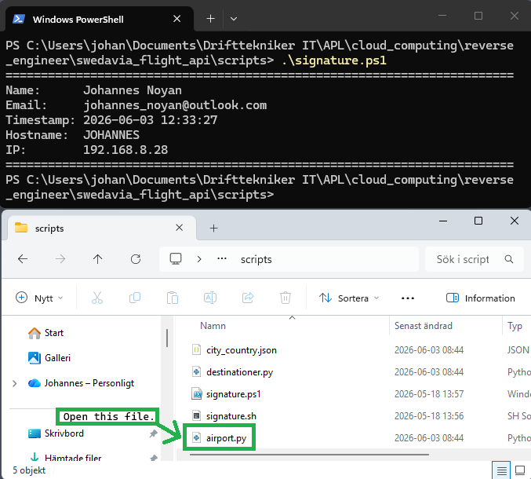
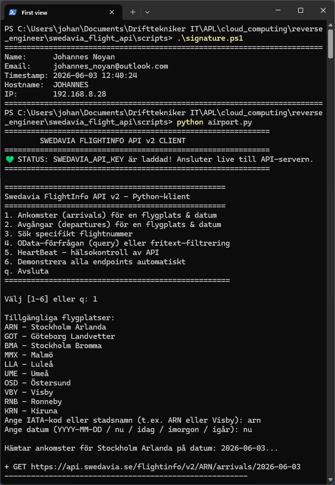
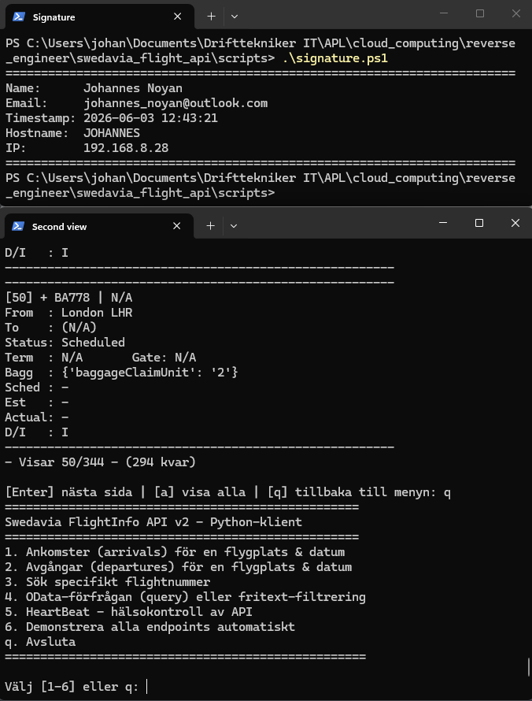

# Logbook - Swedavia Flight API

**Name:** Johannes Noyan \
**Team members:** Johannes Noyan, Ali Cay, Juan Martin \
**Group name:** Grupp2 \
**Email:** johannes_noyan@outlook.com \
**Submitting:** Project - Swedavia Flight API

---

## Work log

### 2026-06-01

**Worked with:**
* We began working with "Part 1: Research and planning".

**What was done:**
* I watched "Buster Swedavia FlightInfo API v2 .mov".
* I read the assignment instructions of "Kopia av 4. Reverse Engineer
  a Result (1).sh"
* We decided to recreate "Swedavia Flight API" application with reverse
  engineering.
* I setup my Git respiratory and Github.
* My first "git commit -m" was done.
* I answered the questions from "Step 2: Ask Questions".
* I answered the questions from "Step 3 → 5: Guess the Inputs, Guess
  the Process, Sketch the Steps".
* We completed "Part 1: Research and planning".
* My second "git commit -m" was done.

**Problems and solutions:** \
No problems or solutions.

**Decisions:** \
No Decisions.

**References:**
* "Buster Swedavia FlightInfo API v2 .mov"
* "Kopia av 4. Reverse Engineer a Result (1).sh"
* https://aistudio.google.com/
* https://copilot.microsoft.com/shares/x3hVi3naxZPyUGsXiJrAp
* https://copilot.microsoft.com/shares/Lgsrf8rW1gE9hazKbvsq7

### 2026-06-02

**Worked with:**
* We began working with "Part 2: Start of work (implementation/
  execution)".

**What was done:**
* I configured setup Gemini in order to prepare it, building the
  "Swedavia Flight API" to us.

**Problems and solutions:**
* Problem 1: To query live Swedish arrivals/departures, I need to
  create a free account in Swedavia website, to receive my
  subscription key. However, their website is currently performing
  an maintenance.
  * https://apideveloper.swedavia.se/ :
    "Portal is currently unavailable due to scheduled
    maintenance. The maintenance window is expected to last until
    2026-06-03 08:00 UTC at the latest.".
* Solution 1: Swedavia is saying "If you need assistance, please
  contact us at integration@swedavia.se". Hence, I will try to send
  an email to them, thinking, I may obtain a subscription key via
  email from Swedavia.
* Problem 2: Gemini created a terminal and web interface.
* Solution 2: Tell Gemini to remove the web interface.
  
**Decisions:** \
No Decisions.

**References:**
* https://copilot.microsoft.com/shares/Ah2r696GJRS3aBkycLMfV
* https://aistudio.google.com/
* "Buster Swedavia FlightInfo API v2 .mov"
 
### 2026-06-03

**Worked with:**
* We continued working with "Part 2: Start of work (implementation/
  execution)".
* We began working with "Part 3: Completion of work (finalization & i
  mprovement)".
* We began working with "Part 4 - Conclusion".

**What was done:**
* I found an API Key for our app and told Gemini to insert it into the
  code.
* We completed "Part 2: Start of work (implementation/
  execution)".
* We removed all excessive files Gemini created to
  "Swedavia Flight API".
* My third "git commit -m" was done.
* We completed "Part 3: Completion of work (finalization & i
  mprovement)".
* My fourth "git commit -m" was done.
* My fifth "git commit -m" was done.

**Problems and solutions:**
* Problem 3: Swedavia website (https://apideveloper.swedavia.se/) was
  not done with their maintenance at the excepted time. Neither did
  they answer my email I sent them (it have been 1 day since I sent
  my email to them). Hence, I need to find a different way to receive
  an API Key.
* Solution 3: I saw that in the "Buster Swedavia FlightInfo AP
  I v2 .mov" video, Najmaddin provided to us, the API Key was
  shared. Hence, I copied it, and told Gemini to insert it into
  our code. Fortunately, the API is still valid and it worked!
* Problem 4: Menu options not working the way they are suppose to. 
* Solution 4: I did not try to find the solutions because we need to
  finish off this project today.

**Decisions:**
### Open this file to start the app

### First view of the app

### Second view of the app

**References:**
* https://aistudio.google.com/
* "Buster Swedavia FlightInfo API v2 .mov"
* https://www.swedavia.se/
* https://www.swedavia.se/arlanda/ankomster/
* https://www.swedavia.se/arlanda/avgangar/
* https://www.swedavia.se/arlanda/avgangar/#/2026-06-02

<!-- 
Work log:
### yyyy-mm-dd

**Worked with:**

**What was done:**

**Problems and solutions:**

**Decisions:**

**References:**
 -->

--

## Part 1: Research and planning
* We decided to recreate "Swedavia Flight API" application with reverse
  engineering.
* Configured Git:
  * Name: Johannes Noyan
  * Email: johannes_noyan@outlook.com
* Initialized my repository with "git init" with the following folder
  structure: screenshot/, scripts/, data/, results/.
* I created the signature scripts: signature.sh, signagure.ps1.
* I setup my Git respiratory and Github. The name of the respiratory
  is "swedavia_flight_api".
* My first "git commit" was:
  * "initial commit: repo structure and logbook template"

### Step 2: Ask Questions

### What kind of data is this?
The data is from "Swedavia FlightInfo API v2" and it displays real time 
flight data of 10 Swedavia airports allocated in Sweden. The flight data
is about arrivals, departures, information about the flights.

To find destination statistics, you need to go to Swedavia website,
because "Swedavia FlightInfo API v2" does not have this information.

### What could have created this?
It looked like it was created with the Python programming language,
"Swedavia FlightInfo API v2", some kind of AI.

### Answer from Gemini 3 Flash Preview:

Based on the document provided, here are the answers to your questions:

### 1. What kind of data does the application have?
The application processes **real-time flight data** sourced from the
"Swedavia FlightInfo API v2." Specifically, it contains:

* **Airport Information:** Data for 10 specific Swedavia airports in
  Sweden (Stockholm Arlanda, Göteborg Landvetter, Stockholm Bromma,
  Malmö, Luleå, Umeå, Östersund, Visby, Ronneby, and Kiruna).
* **Flight Details:** 
  * **Arrivals and Departures:** Flight numbers and the airlines
    operating them.
  * **Route Info:** Origin and destination cities/IATA codes.
  * **Status & Logistics:** Real-time status (e.g., Scheduled,
    Departed), terminal numbers, gate assignments, and baggage belt
    information.
  * **Timing:** Scheduled, Estimated, and Actual times in both UTC
    and CET.
  * **Classification:** Domestic/International (D/I) markers and
    special remarks (e.g., actual departure time).
* **Geographic Mapping:** It uses a `city_country.json` file,
  suggesting it maps airport codes to specific cities and countries.
* **System Health:** "HeartBeat" data used to check the health and
  connectivity of the API.

**Note:** The application specifically **does not** have destination
statistics; the document mentions you must visit the Swedavia website
for that information.

### 2. What could have created the application?
The application was created using the following technologies and
structures:

* **Programming Language:** **Python**. This is confirmed by the file
  extensions (`.py`) and the terminal menu header which identifies it
  as a "Python-klient."
* **External API:** The **Swedavia FlightInfo API v2**. The application
  acts as a client wrapper for this official Swedish airport data
  source, utilizing its OData query endpoints.
* **Data Formats:** It likely uses **JSON** for data handling
  (indicated by `city_country.json`) and **OData** protocol for
  advanced queries.
* **Development Components:**
  * **Modular Code:** The file list (`airport.py`, `destinationer.py`)
    suggests a structured approach where different functionalities
    (airport handling vs. destination mapping) are separated into
    different modules.
  * **Documentation:** The presence of `README.md` and `FÖRKLARING.md`
    indicates a documented development process, likely intended for
    other users or developers to understand how to run the client.
* **Interface Type:** A **CLI (Command Line Interface)**. It is a
  terminal-based application designed for user interaction through
  text menus and keyboard inputs.

### Step 2: End here

### Step 3 → 5: Guess the Inputs, Guess the Process, Sketch the Steps

### What inputs would you need to get this result? What functions or logic might build this?
1. Full project description, I will upload the following files to
   Gemini:
   * high_level_system_instructions.txt, project_overview.txt,
     technical_requirements.txt, menu_terminal_interface.txt,
     api_details.txt, destinations-statistik-2025.csv,
     documentation_files.txt
2. Output format, tell Gemini:
  * "All code and comments must be in English. All user-facing text
    (terminal UI, prompts, messages) must be in Swedish.Use the content
    of destinations-statistik-2025.csv to create city_country.json.
    Output the entire project as downloadable code blocks, one file
    per block. Each code block must clearly specify the filename in
    a comment at the top or in the code fence label.
    
    Generate all necessary files (airport.py, destinationer.py,
    city_country.json content, any helper scripts if needed,
    README.md, FÖRKLARING.md) in this format.".

### Step 3 → 5: Ends here

* My second "git commit" was:
  * "Complete part 1: Research and planning"

## Part 2: Start of work (implementation/execution)
* I configured setup Gemini in order to prepare it, building the
  "Swedavia Flight API" to us.
  * Details
    * Advanced settings
      * Select model for chat: Default (Gemini 3.5 Flash)
      * System instructions: high_level_system_instructions.txt
      * Framework: Next.js
    * Output format
      * Uploaded files: api_details.txt,
        destinations-statistik-2025.csv, documentation_files.txt,
        menu_terminal_interface.txt, project_overview.txt,
        technical_requirements.txt
      * Tell Gemini: "All code and comments must be in English. All
        user-facing text (terminal UI, prompts, messages) must be in
        Swedish.Use the content of destinations-statistik-2025.csv to
        create city_country.json. Output the entire project as
        downloadable code blocks, one file per block. Each code block
        must clearly specify the filename in a comment at the top or
        in the code fence label.
        
        Generate all necessary files (airport.py, destinationer.py,
        city_country.json content, any helper scripts if needed,
        README.md, FÖRKLARING.md) in this format.".

* Problem 1: To query live Swedish arrivals/departures, I need to
  create a free account in Swedavia website, to receive my
  subscription key. However, their website is currently performing
  an maintenance.
  * https://apideveloper.swedavia.se/
    "Portal is currently unavailable due to scheduled
    maintenance. The maintenance window is expected to last until
    2026-06-03 08:00 UTC at the latest.".
* Solution 1: Swedavia is saying "If you need assistance, please
  contact us at integration@swedavia.se". Hence, I will try to send
  an email to them, thinking, I may obtain a subscription key via
  email from Swedavia.
* Problem 2: Gemini created a terminal and web interface.
* Solution 2: Tell Gemini to remove the web interface.
* Problem 3: Swedavia website (https://apideveloper.swedavia.se/) was
  not done with their maintenance at the excepted time. Neither did
  they answer my email I sent them (it have been 1 day since I sent
  my email to them). Hence, I need to find a different way to receive
  an API Key.
* Solution 3: I saw that in the "Buster Swedavia FlightInfo AP
  I v2 .mov" video, Najmaddin provided to us, the API Key was
  shared. Hence, I copied it, and told Gemini to insert it into
  our code. Fortunately, the API is still valid and it worked!

* My third "git commit" was:
  * "Complete Part 2: Start of work (implementation/execution)"

## Part 3: Completion of work (finalization & improvement)
* We removed all excessive files Gemini created to "Swedavia Fli
  ght API".

* Problem 4: Testing the menu options.
  * 1. Ankomster (arrivals) för en flygplats & datum
    * "Sched : -" value is missing.
    * "Term  : N/A" value is missing.
    * The rest of the values are correct according to
      https://www.swedavia.se/arlanda/ankomster/.
  * 2. Avgångar (departures) för en flygplats & datum
    * "From  : (N/A)"
    * "To    : Budapest"
    * "Status: Scheduled"
    * "Term  : N/A       Gate: N/A" value is missing.
    * "Sched : -" value is missing.
    * "Actual: -" value is missing.
    * "Remarks : " is not included in our app, but is included in
      the original app.
    * The rest of the values are correct according to
      https://www.swedavia.se/arlanda/avgangar/.
  * 3. Sök specifikt flightnummer
    * A value from https://www.swedavia.se/arlanda/avgangar/#/
      2026-06-02 was taken.
    * This menu option is not working.
  * 4. OData-förfrågan (query) eller fritext-filtrering
    * I do not know what this menu option is, hence I did not
      test it.
  * 5. HeartBeat - hälsokontroll av API
    * I tested it without API Key and with API Key.
    * Without API Key the heartbeat say that the app is not
      working.
    * With API Ket the heartbeat say that the app is working.
  * 6. Demonstrera alla endpoints automatiskt
    * It seem to work, according to what our app say. However,
      I did not make any further testing, other than this.
  * q. Avsluta
    * Yes, this closes the app.
* Solution 4: I did not try to find the solutions because we need to
  finish off this project today.

* My fourth "git commit" was:
  * "Complete Part 3: Completion of work (finalization & improvement)"

## Part 4: Conclusion

### Questions 
### What did you achieve?
* Full documentation of the work we did in this logbook.md file.
* We almost achieved cloning the original "Swedavia Flight API" from the
  "Buster Swedavia FlightInfo API v2 .mov" video, using reverse
  engineering.
* Some screenshots of the app we created.

### What did you learn?
* I learned what "reverse engineering" is and how it is used.
* I learned more about working in a group.
* I learned more about Gemini GenAI from "Google AI Studio" and how to
  work with GenAI.
* I learned more about how to setup up an input prompt to Gemini GenAI.
* I learned more about how to document my work.
* I learned more about testing an app.

### What could you improve?
* If https://apideveloper.swedavia.se/ was not performing a
  maintenance, we could had obtained our own API Key.
* We could have resolved "Problem 4". However, we did not try to find
  the solutions because we needed to finish off this project today.
* We could had made further testing of the menu options of the app.
* We could have provided a html interface, hosted via AWS. The app
  would had looked better and become user friendly. Also, the user,
  would not need to setup anything, before running the app. All that
  would be needed, is to visit the website and use the app.

### End of questions

* My fifth "git commit" was:
  * "Completed part 4: Conclusion"